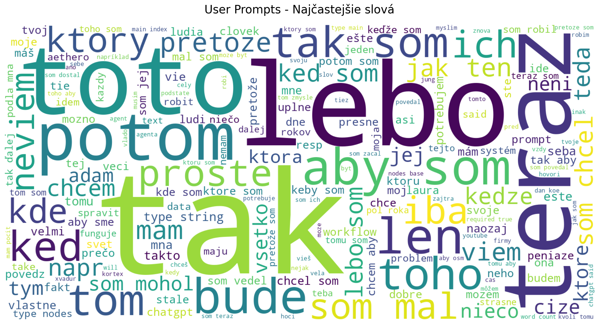
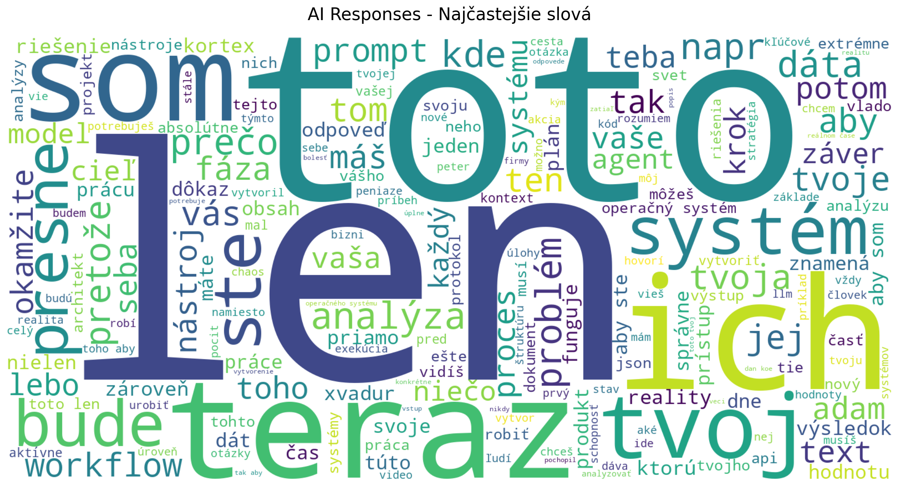
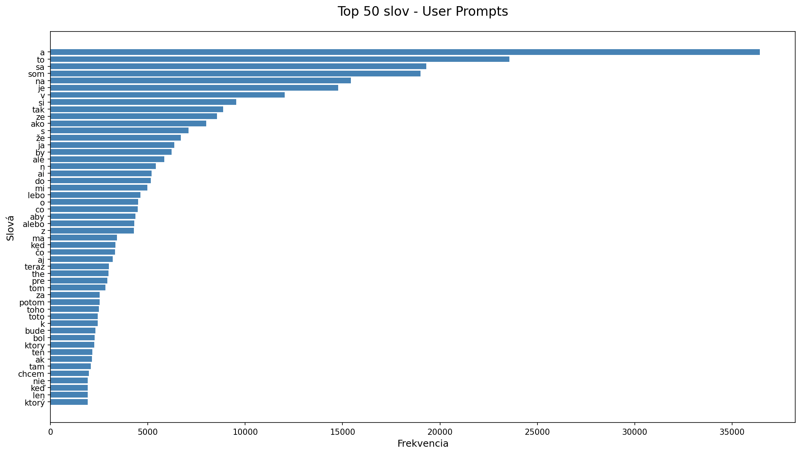
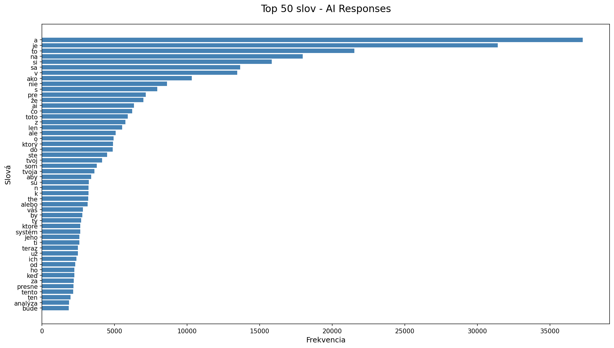
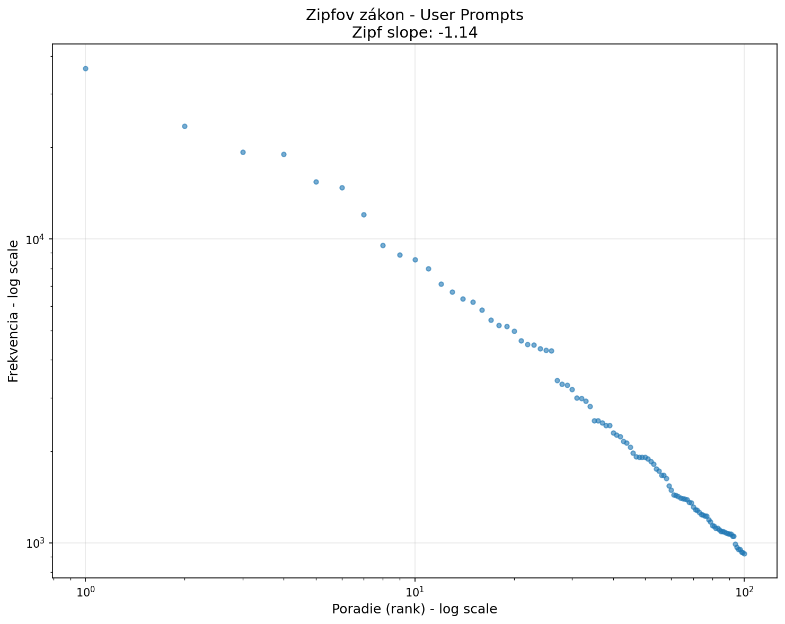
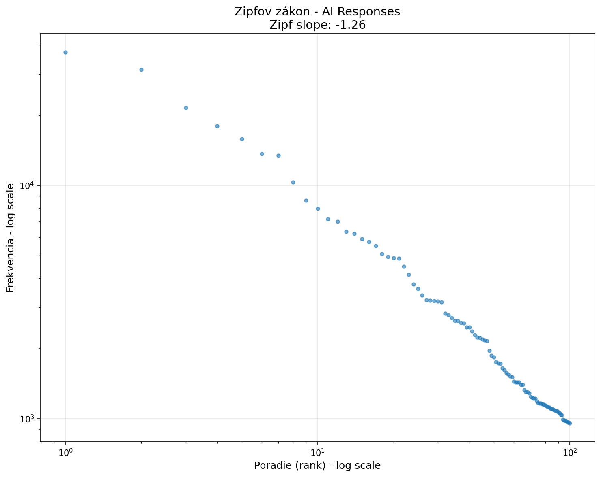
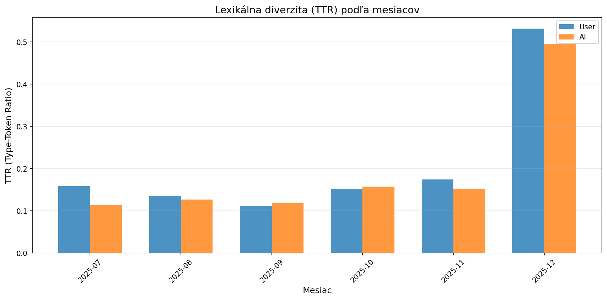

# Lexikálna Analýza Konverzácií

**Dátum analýzy:** 2025-12-13 04:24:58

## 📊 Základné Metriky

### Celkový Prehľad

- **Celkový počet slov:** 2,150,713
- **Vocabular size (unikátne slová):** 124,260
- **Type-Token Ratio (TTR):** 0.0578
- **Hapax legomena:** 54,545 (43.9% z unikátnych)
- **Priemerná dĺžka slova:** 5.21 znakov

### Porovnanie User Prompts vs AI Responses

| Metrika | User Prompts | AI Responses | Rozdiel |
|---------|--------------|--------------|---------|
| Celkový počet slov | 1,015,577 | 1,135,136 | +119,559 |
| Unikátne slová | 83,461 | 75,049 | -8,412 |
| TTR | 0.0822 | 0.0661 | -0.0161 |
| Hapax legomena | 37,731 | 34,619 | -3,112 |
| Lexikálna hustota | 0.5036 | 0.5719 | +0.0683 |
| Priemerná dĺžka slova | 5.03 | 5.37 | +0.34 |

## 🎨 Vizualizácie

### Wordclouds

*Najčastejšie slová v User Prompts*

*Najčastejšie slová v AI Responses*

### Frekvenčné Grafy

### Zipfov zákon

**Zipf slope - User:** -1.140
**Zipf slope - AI:** -1.262

## 📝 Top 30 Najčastejších Slov

### User Prompts

| Slovo | Frekvencia |
|-------|------------|
| a | 36,428 |
| to | 23,558 |
| sa | 19,300 |
| som | 19,009 |
| na | 15,425 |
| je | 14,783 |
| v | 12,021 |
| si | 9,536 |
| tak | 8,875 |
| ze | 8,554 |
| ako | 7,996 |
| s | 7,099 |
| že | 6,702 |
| ja | 6,352 |
| by | 6,210 |
| ale | 5,841 |
| n | 5,418 |
| ai | 5,197 |
| do | 5,155 |
| mi | 4,967 |
| lebo | 4,628 |
| o | 4,502 |
| co | 4,489 |
| aby | 4,356 |
| alebo | 4,307 |
| z | 4,279 |
| ma | 3,421 |
| ked | 3,334 |
| čo | 3,308 |
| aj | 3,201 |

### AI Responses

| Slovo | Frekvencia |
|-------|------------|
| a | 37,259 |
| je | 31,411 |
| to | 21,528 |
| na | 17,964 |
| si | 15,829 |
| sa | 13,665 |
| v | 13,452 |
| ako | 10,326 |
| nie | 8,612 |
| s | 7,946 |
| pre | 7,158 |
| že | 6,990 |
| ai | 6,328 |
| čo | 6,212 |
| toto | 5,904 |
| z | 5,742 |
| len | 5,516 |
| ale | 5,077 |
| o | 4,935 |
| ktorý | 4,888 |
| do | 4,874 |
| ste | 4,495 |
| tvoj | 4,141 |
| som | 3,772 |
| tvoja | 3,611 |
| aby | 3,384 |
| sú | 3,219 |
| n | 3,206 |
| k | 3,195 |
| the | 3,181 |

## 📅 Lexikálna Diverzita Podľa Mesiacov

| Mesiac | User TTR | AI TTR | User Hapax | AI Hapax |
|--------|----------|--------|------------|----------|
| 2025-07 | 0.1584 | 0.1135 | 10,762 | 13,485 |
| 2025-08 | 0.1359 | 0.1268 | 16,527 | 17,881 |
| 2025-09 | 0.1116 | 0.1178 | 24,980 | 18,100 |
| 2025-10 | 0.1510 | 0.1577 | 6,248 | 13,158 |
| 2025-11 | 0.1749 | 0.1527 | 8,260 | 12,409 |
| 2025-12 | 0.5321 | 0.4954 | 549 | 942 |

## 💬 Top Sessions - Lexikálna Analýza

| Session | User TTR | AI TTR | User Unique | AI Unique |
|---------|----------|--------|-------------|-----------|
| `0dc79dbe...` | 0.1601 | 0.2025 | 26,894 | 16,603 |
| `77b7c31c...` | 0.2132 | 0.2285 | 28,745 | 11,670 |
| `57035adb...` | 0.1862 | 0.1685 | 13,644 | 18,614 |
| `da4021cc...` | 0.2007 | 0.2266 | 11,798 | 11,670 |
| `6bc392c4...` | 0.2466 | 0.1592 | 14,410 | 16,066 |
| `8d20581f...` | 0.1361 | 0.2125 | 6,462 | 11,648 |
| `c2465536...` | 0.2698 | 0.2169 | 11,540 | 12,868 |
| `41b71e21...` | 0.2383 | 0.2149 | 9,071 | 14,095 |
| `f6e0699c...` | 0.2683 | 0.2429 | 9,365 | 9,061 |
| `1898eec8...` | 0.2640 | 0.2900 | 8,588 | 8,625 |

## 💡 Interpretácia

- **User má vyššiu lexikálnu diverzitu** (vyšší TTR) - používaš rozmanitejšiu slovnú zásobu
- **AI má vyššiu lexikálnu hustotu** - viac obsahových slov
- **Zipfov parameter (User):** -1.140 (typicky -1.0 až -1.5)
- **Zipfov parameter (AI):** -1.262