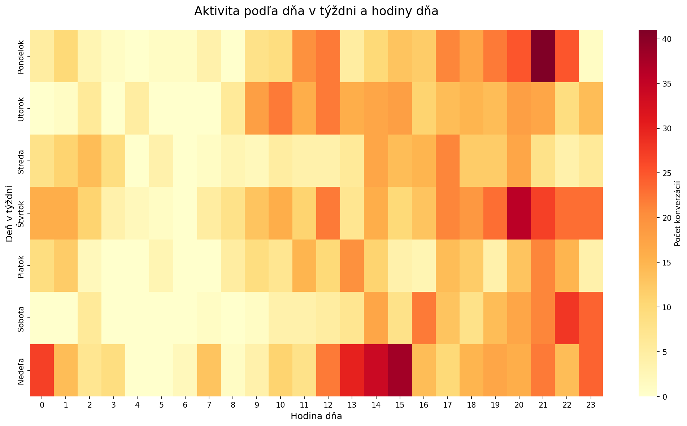
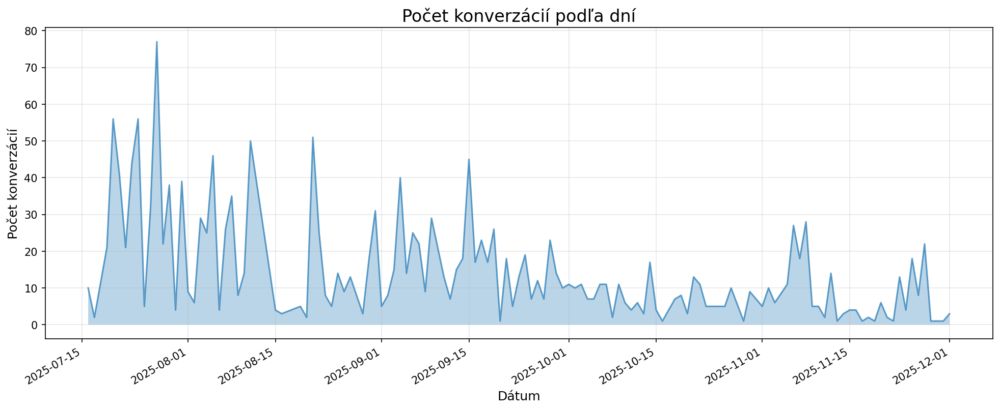
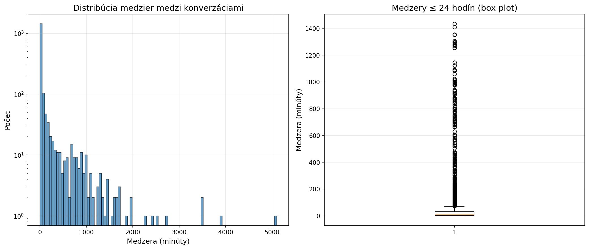

# Časová Analýza Konverzácií

**Dátum analýzy:** 2025-12-13 04:19:00

**Celkový počet konverzácií:** 1,820

## 📅 Dátumový Rozsah

- **Od:** 2025-07-16 20:36:46
- **Do:** 2025-12-01 03:01:22
- **Rozsah:** 137 dní

## 🗓️ Heatmapa Aktivity

*Aktivita podľa dňa v týždni a hodiny dňa*

### Top 10 Najaktívnejších Hodín

| Hodina | Počet konverzácií |
|--------|-------------------|
| 21:00 | 157 |
| 20:00 | 142 |
| 14:00 | 122 |
| 22:00 | 118 |
| 17:00 | 114 |
| 12:00 | 107 |
| 19:00 | 106 |
| 15:00 | 105 |
| 18:00 | 98 |
| 23:00 | 96 |

### Aktivita Podľa Dňa v Týždni

| Deň | Počet konverzácií |
|-----|-------------------|
| Pondelok | 276 |
| Utorok | 259 |
| Streda | 197 |
| Štvrtok | 343 |
| Piatok | 193 |
| Sobota | 200 |
| Nedeľa | 352 |

## 📝 Dĺžka Textov Podľa Času

### Priemerný Počet Slov Podľa Hodiny

| Hodina | Priemerný počet slov |
|--------|---------------------|
| 00:00 | 477 |
| 01:00 | 659 |
| 02:00 | 227 |
| 03:00 | 174 |
| 04:00 | 147 |
| 05:00 | 216 |
| 06:00 | 160 |
| 07:00 | 106 |
| 08:00 | 576 |
| 09:00 | 584 |
| 10:00 | 514 |
| 11:00 | 440 |
| 12:00 | 469 |
| 13:00 | 460 |
| 14:00 | 414 |
| 15:00 | 845 |
| 16:00 | 659 |
| 17:00 | 573 |
| 18:00 | 1224 |
| 19:00 | 666 |
| 20:00 | 453 |
| 21:00 | 477 |
| 22:00 | 462 |
| 23:00 | 336 |

### Priemerný Počet Slov Podľa Dňa v Týždni

| Deň | Priemerný počet slov |
|-----|---------------------|
| Pondelok | 765 |
| Utorok | 564 |
| Streda | 665 |
| Štvrtok | 563 |
| Piatok | 460 |
| Sobota | 401 |
| Nedeľa | 382 |

## 📈 Časový Vývoj Aktivity

## ⏱️ Medzery Medzi Konverzáciami

### Štatistiky Medzier

- **Medián medzery:** 9.1 minút (0.15 hodín)
- **Priemerná medzera:** 108.7 minút (1.81 hodín)
- **Minimálna medzera:** 0.3 minút
- **Maximálna medzera:** 5100.8 minút (85.0 hodín, 3.5 dní)
- **P95 medzera:** 731.2 minút (12.19 hodín)
- **Medián medzery (dni):** 1.0 dní
- **Priemerná medzera (dni):** 1.2 dní

## 💡 Interpretácia

- **Najaktívnejšia hodina:** 21:00 (157 konverzácií)
- **Najaktívnejší deň v týždni:** Nedeľa (352 konverzácií)
- **Priemerná medzera:** 9 minút - aktívne písanie